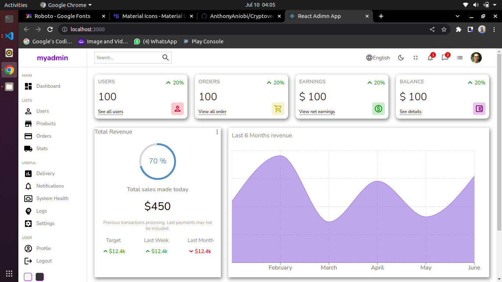

# My Admin Application

This is a react js project with an admin dashboard template that can be reused for any project that requires admin page and also for user management applications.

## Techonologies

Technologies and libraries used for this project are:
- React js
- Sass
- Material UI 
- rechartsjs
- react-circular-progressbar

## screenshots

Screenshots for the application are:

## setup

To setup this project on your local device:

1. Clone or download the application from [Github](https://github.com/AnthonyAniobi/Admin_Dashboard)
2. Run on the command line in the app directory `npm i` to install packages
3. Start the application using `npm start`